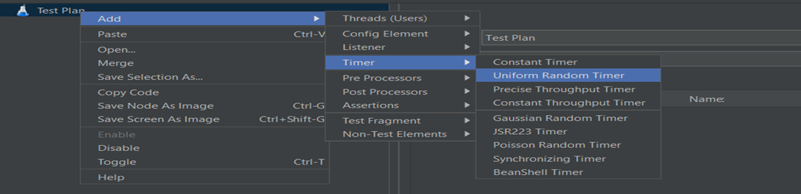

# Section -1    Intro
# 1. Jmeter Introduction

## Normal Testing
```
So, when you say a normal testing which is a functional testing,
Let's pick amazon.com. So here, you want to purchase this remote. It's a Fire TV Stick with Alexa.You want to buy this. So when you ask to test this functionality,
you will select this and go to the purchase page, give your address so that it will get deliveredinto your location. 
So that's an end-to-end flow to test if you are able to buy any product with Amazon.
```
## Now, how different it is from performance testing then?
```
But when you bring performance into picture, we are testing the same flow under a particular workload.

So let's say you want to test that flow of purchasing the Alexa with 1000 users. So when 1000 users are trying to buy that product,how the Amazon servers are responding.
Are they responding in the similar way when 1 guy purchases it or is the website slow when thousand users are trying to access and buy a product?

So, we are testing our server with some workload.
That type of testing is called performance testing.

Or

now you want to buy a product from Amazon and you are keep on buying continuously for 100 hours.So that means you are hitting Amazon server to purchase something continuously for 100 hours So is your server still stable when continuous hits cap happening on your server?
That you need to test.

So basically, we are testing a flow under some load and deciding the performance of that application.That's why we call it as performance testing.

There is testing called load testing, stress testing, volume testing, endurance testing. So all this come under a common umbrella of performance testing.
```
## So why this performance testing is necessary for every application?
```
Let’s say you have independence day sale – put adds 1 month before  -- price will be short during this period. 2k is reduce to 1k, develover write code. 

On independence day 10K users reached your website for buying particular produce and your website unable to handle that.

U write manual test automation test, but if your server goes down so you lost the game. 

So Performance testing is necessary in that case, If you have heavy traffic to your website.
```
## how does load testing tools help us to measure the performance of this application?
JMeter which is one load testing tool which will help us to give the details on how system behaves when load is applied on your application.

So first you develop a script to buy a product from Amazon and then this load testing tool have a featuresto apply some thousand users, 10,000 users, or apply the load for five hours (stress testing,),
you will have different features available in these tools to apply different combinations of load on this script.

In  Selenium you write script of 1 user in order to check end to end flow.

In Marker apart from JMeter,  there is a tool called NeoLoad, LoadRunner and loadUI.```
# 2. Advantage of Jmeter over other Performance Testing Tools

## why JMeter? - It's an Open Source
```
So JMeter is an open source. That means you can download this tool for free and start performing your test on your application.
Selenium is also open source, it's just like Selenium , but for performance testing.
Selenium is functional testing, Jmeter is for performance testing.

LoadRunner is great but paid one.
```
## Cross platform support
```
this JMeter is built on Java, so when something is built on Java, that means that tool will work on any platform.
So you can use this tool with Windows, Mac, Linux, Solaris. For all these operating systems,
```

## Scripting in Jmeter

```
Scripting is not essential to learn Jmeter
You need not build any script from scratch while working with JMeter,

So we have a record and playback function which help you to generate script automatically without putting much effort. 

But for advance load testing script is required
```
## Jmeter GUI is very friendly.
# 3. Jmeter Installaton and Configuration
# 4. Jmeter Tool Overview
## what is Test Plan?
```
test plan consists of all actions and components you need to execute your performance test script.
So here is where your actual execution will be there.
So you need to add the components,
 you need to add the script,
 you need to add all kind of actions, okay?
To run the base Jmeter test cases under this folder test plan.

In Eclipse :  Once you open the workspace, you can work on seven or eight projects, anything, any number
you can create a project.

But in JMeter at a time, you can work only on one project.
So you have to open this tool freshly

So that project details should go under this test plan.
```
## what is WorkBench?

```
So Workbench is basically, it can be taken as a practice area or temporary storage of the components.
Okay? So whatever you write under this will not be part of execution.
```
## Thread:

```
So threads is basically to put load onto your Jmeter test.
Threads basically put a load on a script and test fragment
```
## Config element

```
 it's like you have to set some cookies for your test to run rerun every time.
 you have to set some headers.
And if you want to put some JDBC Connections
and some, if you want to put some random variables.
So basically configuration configuring your test based upon your needs.
```
## Timer

```
like before one request and another request you if you want to wait some time you can use this timers
and each timer have their O- unique definition and unique way of dealing with requests.
```
## Preprocessor

```
like before starting the test you have to do some pre processing
like tweaking HTLM link
or executing some script to load all environment variables into your test to run using data driving.
```
## Post Processor

```
This is basically after completing the execution. If you want to retrieve the response and retrieve some variables out of the response using Regular Expression, XPath.
```
## Assertions

```
Assertions is to put for validation.
So once you get a response, you want to put validation to make sure right values are displaying in the responses.
So these are different type of assertions you have
```
## Listener

```
Listeners are nothing but test results
like how your test is performing  and with various performance metrics 
and how does it results look like.
So all will be done in the Listeners.
```
## Time running and test pass

```
if you run your test for five minutes
you can see the timeline here, like how many
how much time the test is running.
Once you invoke that test
you will see that time running here.
And if there are a hundred tests and out of hundred 40 are finished
you'll see here some like 40/100 40/100 and something fails you'll report it here.
```
# Quiz


